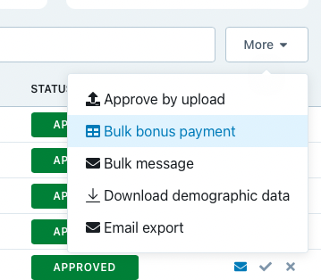

# Automatic generation of bonus CSV for Prolific

This script generates a CSV file for the bonus submission for Prolific. For convenience, it also copies the valid string to your clipboard.

  

## How to use this?
Simply call `get_bonuses_from_mongo`. It takes:
* `db`: the database to use
* `collection`: the collection to use
* `iteration`: the specific iteration of the experiment to use
* `bonus_function`: the function to use to generate the bonus. This is specific to your experiment. It takes an input the subset of the data corresponding to one game and returns `False` (or 0) if that game does not get a bonus or a dollar amount if it does.
* `bonus_function_params` (optional): a dictionary of named parameters to pass to the bonus function. E.g. `{'threshold':0.5,'bonus':2.34}`

An example of a simple bonus function is:
```
def acc_bonus_function(participant_df,bonus=1.5,threshold=0.5):
    """Sample bonus function. Returns $1.5 if accuracy is above 50%"""
    assert participant_df[GAME_ID].nunique() == 1, "Not just 1 game passed"
    if participant_df.agg("response").mean() > threshold:
        return bonus
    else:
        return False
```

Please make sure that you have a SSH tunnel to cogtoolslab.org by running `ssh -fNL 27017:127.0.0.1:27017 USERNAME@cogtoolslab.org` in your shell.

You will also need `auth.txt` with the password for mongoDB user `sketchloop` in the same directory as this file.